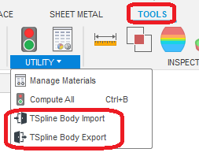
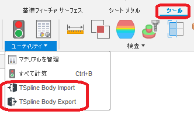

# ***Fusion360 TSplineBody Doorway***
This is a Add-in for Autodesk software "Fusion360".

Import / export TSplineBody.
***

### Installation:
Please follow the instructions [here](https://knowledge.autodesk.com/support/fusion-360/troubleshooting/caas/sfdcarticles/sfdcarticles/How-to-install-an-ADD-IN-and-Script-in-Fusion-360.html).

### Usage - import:
1. Start Add-in.

1. Click 'TSpline Body Import' in the Utility panel.
1. Select the tsm file to import from the file open dialog. 
1. Imported into the root component, the file name and body name will be the same.

### Usage - export:
1. Start Add-in.

1. Click 'TSpline Body Export' in the Utility panel.
1. A dialog will appear, showing a list that can be exported.
 The displayed name is ＜Body name＞:＜Feature name＞:＜Component name＞.
1. Check the body to export and press the OK button.
1. Select the export destination folder in the dialog.
1. Exported for each body.
    The file name is ＜body name＞_＜future name＞_＜component name＞.tsm.

### Action:
Confirmed in the following environment.
+ Fusion360 Ver2.0.6670
+ Windows10 64bit Pro , Home

### License:
MIT

### Acknowledgments:
+ I used this convenient [framework.](https://github.com/tapnair/Fusion360AddinSkeleton)
 Thank you Patrick Rainsberry.
+ Thank you everyone in the [Japanese forum.](https://forums.autodesk.com/t5/fusion-360-ri-ben-yu/bd-p/707)

***
以下、日本語です。
これは、オートデスクソフトウェア「Fusion360」のアドインです。

TSplineBodyをインポート/エクスポートを提供します。

### インストール:
[こちら](https://knowledge.autodesk.com/ja/support/fusion-360/troubleshooting/caas/sfdcarticles/sfdcarticles/JPN/How-to-install-an-ADD-IN-and-Script-in-Fusion-360.html)の手順に従ってください。

### 使用法 - インポート:
1. アドインを起動。

1. ユーティリティパネルの 'TSpline Body Import' をクリック。
1. ファイルを開くダイアログからインポートするtsmファイルを選択します。
1. ルートコンポーネントにファイル名と同じ名前で、ボディがインポートされます。

### 使用法 - エクスポート:
1. アドインを起動。

1. ユーティリティパネルの 'TSpline Body Export' をクリック。
1. ダイアログが表示され、エクスポート可能なリストが表示されます。
  表示される名称は　<ボディ名>:<フューチャー名>:<コンポーネント名>　です。
1. 任意のボディにチェックを入れ、OKボタンを押します。
1. エクスポート先のフォルダを、ダイアログで選択します。
1. ボディ毎にエクスポートされます。
　ファイル名は　<ボディ名>_<フューチャー名>_<コンポーネント名>.tsm　です。

### アクション:
以下の環境で確認しています。
 + Fusion360 Ver2.0.6670
 + Windows10 64bit Pro , Home

### ライセンス:
MIT

### 謝辞:
+ こちらの便利な[フレームワーク](https://github.com/tapnair/Fusion360AddinSkeleton)を試用しました。
 Patrick Rainsberryさん、ありがとう。
+ [日本語フォーラム](https://forums.autodesk.com/t5/fusion-360-ri-ben-yu/bd-p/707)の皆さん、ありがとう。
+ 上記の英語で不適切な部分をして頂けると助かります。